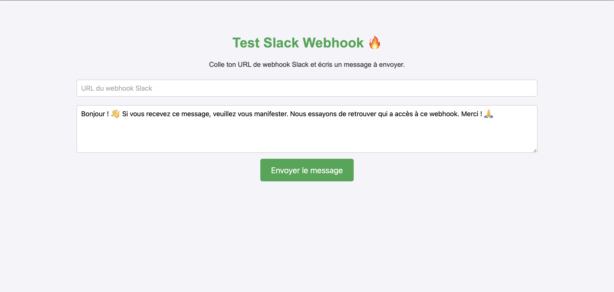

# Incoming-WebHooks-Tester
Ce projet est une page HTML simple permettant de tester l'envoi de messages vers un webhook Slack.

## Fonctionnalités
- Entrer une URL de webhook Slack
- Rédiger un message personnalisé
- Envoyer le message en un clic
- Interface simple et épurée

## Prérequis
- Un navigateur web moderne
- Une URL de webhook Slack valide (générée depuis une intégration Slack)

## Capture d'écran

## Utilisation
1. Ouvrez le fichier `index.html` dans votre navigateur.
2. Collez votre URL de webhook Slack dans le champ prévu.
3. Rédigez votre message (ou utilisez le message par défaut).
4. Cliquez sur "Envoyer le message".
5. Vérifiez la réception du message sur Slack.

## Déploiement
Ce projet étant une simple page HTML, vous pouvez l'héberger sur n'importe quel serveur web ou l'utiliser localement.

## Sécurité
- **Ne partagez jamais votre URL de webhook Slack publiquement** afin d'éviter tout abus.

## Licence
Ce projet est fourni sans licence spécifique. Vous pouvez l'utiliser et le modifier librement.